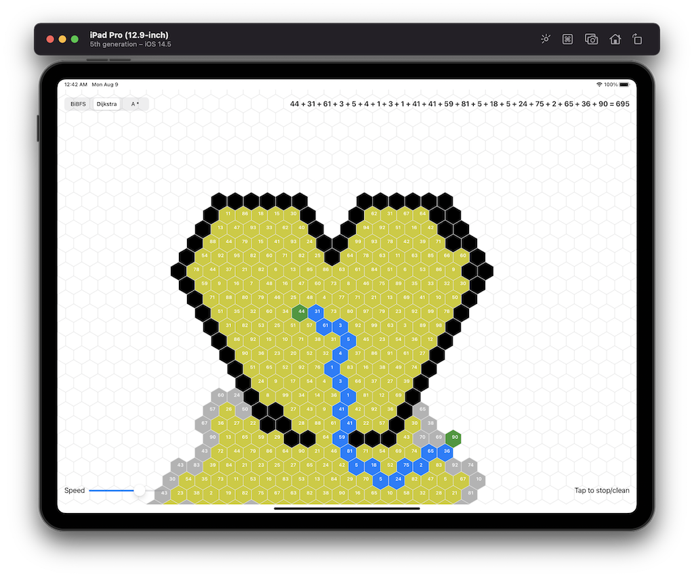

# Description:
Visualization of some path finding algorithms, implemented by Swift 5 and SwiftUI

# Demo Video
https://www.youtube.com/watch?v=QA38KtqBpiA

# Steps:
- Hold and drag to draw walls (Dijsktra & A*) 
- First tap to mark as start point
- Second tap to mark as destination

# Screenshot:

